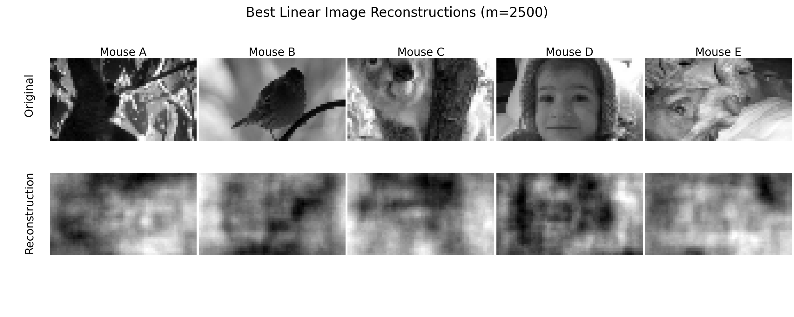

# Sensorium Image Reconstruction
This repository contains the code used for Part 1 of the MInf Thesis on Neural Image Reconstruction from mouse primary visual cortex (V1). The goal of this project is to reconstruct visual stimuli from neural activity patterns recorded in mouse V1. We implement and compare various approaches, including [Schoenmakers' linear Bayesian model](https://pubmed.ncbi.nlm.nih.gov/23886984/) and several deep learning architectures. Additionally, we experiment with integrating behavioral features into the models to explore their impact on reconstruction performance.

## Dataset
The dataset used in this project comes from the [Sensorium 2022 competition](https://arxiv.org/abs/2206.08666) on neural encoding. We repurposed this dataset for the task of neural decoding and image reconstruction. The dataset consists of neural activity recordings from mouse V1 along with the corresponding visual stimuli, as well as behavioural features such as running speed of the mouse.
Here is a sample from the dataset:

The dataset can be found & downloaded [here](https://gin.g-node.org/cajal/Sensorium2022)

## Models
In this project, we explore various approaches for image reconstruction from mouse V1 neural activity. We implement Schoenmakers' linear Bayesian model and compare it with several deep learning architectures. The deep learning models include Multi-Layer Perceptrons (MLPs) and Graph Convolutional Networks (GCNs), which are implemented using PyTorch. Additionally, we experiment with integrating behavioral features into the models to investigate their impact on reconstruction performance. By comparing these different approaches, we aim to identify the most effective methods for neural decoding and image reconstruction in the context of mouse V1.

## Results
We evaluate the performance of the implemented models using pixel-wise correlation. The table below summarizes the performance results:

**Linear Bayesian Model**:
| Model    | Behaviour | Pixel-wise correlation |
| -------- | ------- | ------- |
| Linear Bayesian  | False    | 0.4076
| Linear Bayesian | True     | 0.4104

**Deep Models**:
| Mouse specific module    | Core module | Behaviour | Pixel-wise correlation |
| -------- | ------- | ------- | ------- |
| mouseMLP | coreMLP | False | 0.3899 |
| mouseMLP | coreMLP | True | 0.4053 |
| mouseMLP | coreDecoder | False | 0.3928 |
| mouseMLP | coreDecoder | True | 0.4108 |

Some examples of reconstructions generated by the linear Bayesian model:

## Repository Structure
`data/`: Contains the Sensorium dataset (not included in the repository)  
`models/`: Contains the implementation of the different models  
`notebooks/`: Contains Jupyter notebooks for data exploration, linear Bayesian model training, and evaluation  
`utils/`: Contains utility functions and scripts  
`README.md`: This file, providing an overview of the project  
